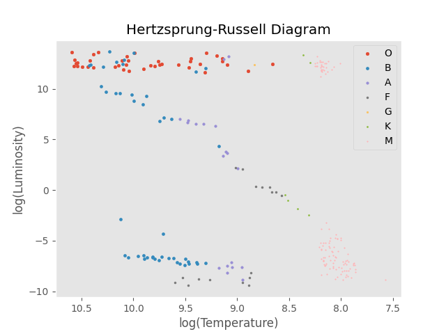
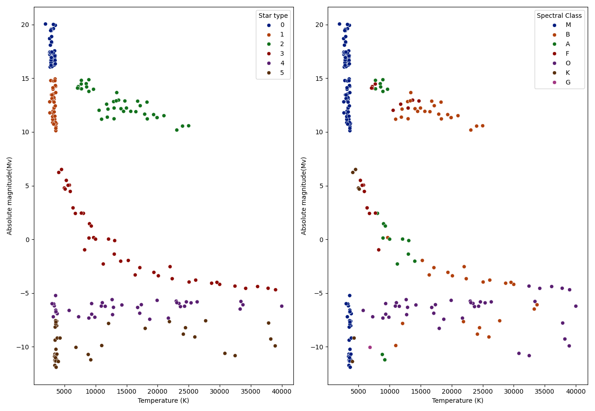
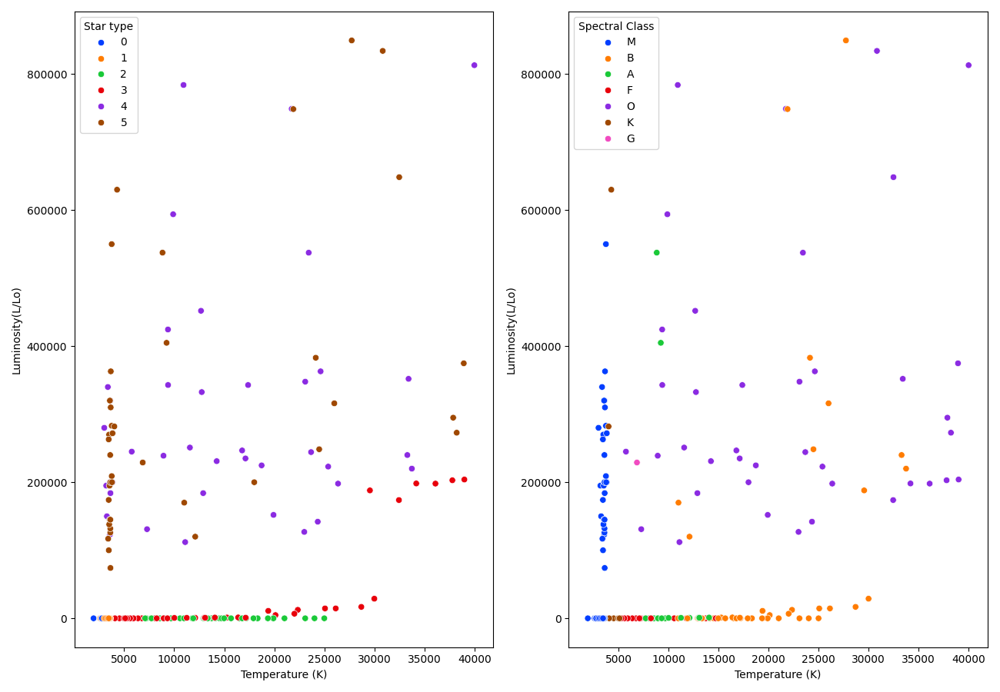
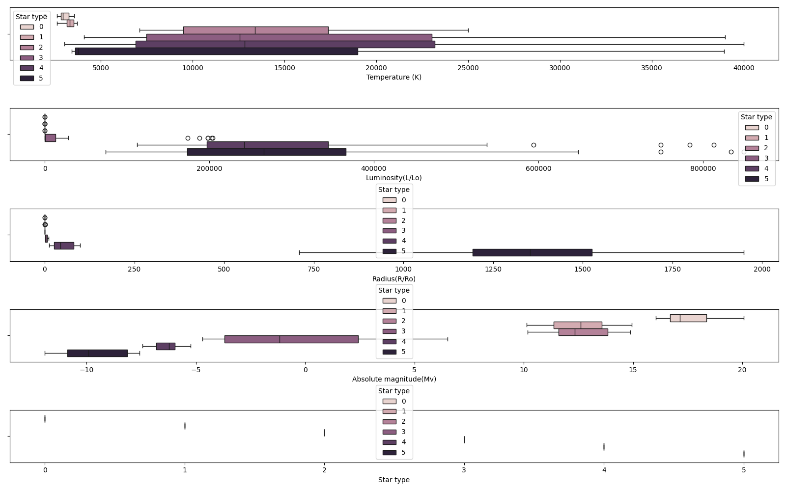

# STELLARTYPE ✴️

## Description 📄

This repository was developed for creating a Machine Learning Model for Star Type / Spectral Class Classification. So here I am using the `scikit-learn` library for model training and joblib for model dumping.

## Models 🤖

Using my notebooks I have generated two models. They are: `kn3_model.pkl` and `gridsearchcv_best_model.pkl`, their creation and description are going to be discovered in the next topics.

## Installation ⚙️

Here is the detailed process of installation:

1. Clone the repository - `git clone https://github.com/pyc4che/stellartype.git | cd stellartype`
2. Create the Virtual Environment - `python -m venv .venv`
3. Activate the Virtual Environment - `source ./.venv/bin/activate`
4. Install required packages using `requirements.txt` file - `python -m pip install -r requirements.txt`

After all of this steps you are ready to launch the program, for this type: `jupyter notebook`. YOur default browser will be opened automatically.

## HR-Diagram (Hertzsprung-Russell Diagram) 📈

Well the first notebook that you will see is going to be `hr_diagram.ipynb` where the HR-Diagram creation is described.
The file is well-documented, so it's not hard to understand the process of creation. I will just show you the result of the action

Here, on this picture you can see the Hertzsprung-Russell Diagram with printed classes on it.

## Machine Learning Model 🦾

The second notebook you see is `ml_classification.ipynb` the main purpose of this notebook is the training, testing and creation of the model. I can say that even with a small dataset it works fine. 98% of accuracy is a great result for the dataset with only just 240 star-type objects.

Let's deepen into our Machine Learning process a bit.

### Packages 📦

For the Machine Learning process we have to read,  make our data preprocessed, train our model and save it. So for this all actions we need the variate of required packages, like:

1. Pandas - Read our Dataset;
2. Numpy - Linear Algebra actions;
3. Seaborn and Matplotlib - Data Visualization;
4. Scikit-Learn - Data Preprocessing and Model Training;
5. JobLib - Model Dumping (Saving);

### Data Processing 🧪

As dataset I am going to use this [kaggle dataset](https://www.kaggle.com/datasets/deepu1109/star-dataset)

This section divides in a couple of actions:

1. Dataset Information - Basic Dataset Information
2. Dataset Visualization - Ploting the Diagrams
    - Temperature(K) vs. Absolute Magnitude(Mv)
    - Temperature(K) vs. Luminosity(L/Lo)

As the result we have two diagrams:

**Temperature(K) vs. Absolute Magnitude(Mv)**

**Temperature(K) vs. Luminosity(L/Lo)**

### Preprocessing 🔨

Well, this is the most interesting part. Now, we are going to train our model and then save it. So let's move on.

This process divides into several steps:

1. Dataframe Splitting - Splitting into features to perform preprocessing:
    - Categorical
    - Numeric
2. Visualizing outliers - Checking How stable the Data Is
3. Dataframe Scaling - Helps to Improve the Performance of Our Algorithm
4. Working with scaled Data - Encoding and Combining Data
5. Modeling with manual KNeighborsClassifier -using `sklearn.neighbors.KNeighborsClassifier` Class for Learning the Model
6. Analyzing Results - Output the Train/Test Score, Classification Metrics, Bias/Variance Error. Making a Conclusion
7. Modeling with GridSearchCV - Using `sklearn.model_selection.GridSearchCV` Class for Generating the most optimal `n_neighbors` value
8. Dumping Model - Saving the model to a .pkl file

- *I will explain the difference between this two types of training the model, but a bit later*

**Visualizing outliers**

Now we are going to see the difference between two models creation:

In this model we manual set `n_neighbors` value to *3*. And that is the only difference between our models. In GridSearchCV we have range of values and the programme automatically searches the best value, the programme founded the best value is - *2*. The whole code and description is in the notebook. As the result we have two Test Scores: 1 - 97.92%; 2 - 97.84%

Then we can save our models, the whole description is given in the code.

## Thanks, Bye 👋🏻
